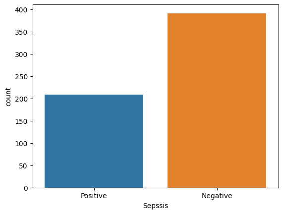
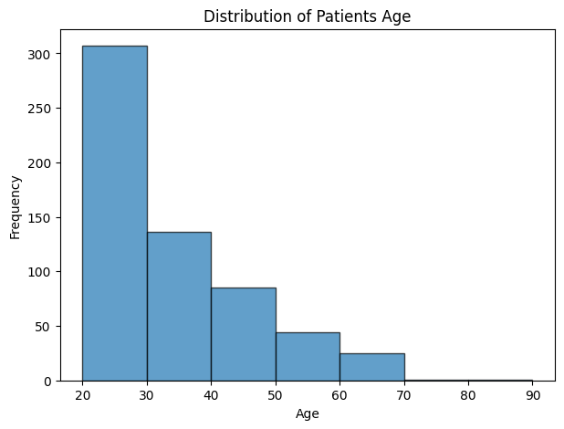
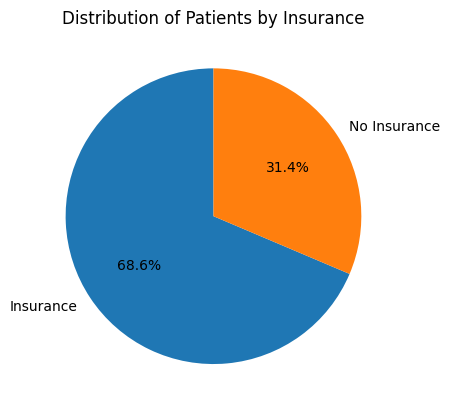

# Sepsis Prediction API Using Fast Api

Sepsis is a critical medical condition that requires prompt diagnosis and intervention. This project leverages FastAPI to provide a robust and efficient solution for predicting sepsis. Fast API is designed to predict the likelihood of sepsis based on various input parameters. The underlying model is trained to provide accurate predictions, aiding healthcare professionals in making timely and informed decisions. The repository includes a demo application with comprehensive API documentation, making it easy to explore and interact with the predictive model.

## Project Structure Overview
1. src Folder:
* The src folder contains the source code of the FastAPI application.
* It typically includes the main application file, such as main.py, where the FastAPI instance is created, and routes and endpoints are defined.
* It may also include additional modules or packages for organizing the code logically.

2. Assets Folder:

* The Assets folder has the pre-trained model, data files, or any other assets required for the application to function.

3. Dockerfile:

* The Dockerfile is a configuration file used to build a Docker container for the FastAPI application.
* It specifies the base image, sets up the working directory, installs dependencies, copies the application code into the container, and defines the command to run the application.
* Dockerfiles are crucial for creating reproducible and portable environments.

## Setup
Before running the evaluation locally, ensure you have Python 3 installed. Create and activate a virtual environment, then install the required packages listed in requirements.txt.
Follow the steps below:

Windows:
``````
  python -m venv venv; venv\Scripts\activate; python -m pip install -q --upgrade pip; python -m pip install -qr requirements.txt  
``````
Linux & MacOs:
``````
  python3 -m venv venv; source venv/bin/activate; python -m pip install -q --upgrade pip; python -m pip install -qr requirements.txt  
``````

The both long command-lines have a same structure, they pipe multiple commands using the symbol ; but you may manually execute them one after another.

Create the Python's virtual environment that isolates the required libraries of the project to avoid conflicts;
Activate the Python's virtual environment so that the Python kernel & libraries will be those of the isolated environment;
Upgrade Pip, the installed libraries/packages manager to have the up-to-date version that will work correctly;
Install the required libraries/packages listed in the requirements.txt file so that it will be allow to import them into the python's scripts and notebooks without any issue.
NB: For MacOs users, please install Xcode if you have an issue.

## Exploratory Data Analysis

The analysis is done in this file(Analysis)[Sepsis_Prediction.ipynb]

### What the Distribution of Sepsis



There are 391 negative cases which are the patients who did not develop sepsis during their stay in the intensive Care Unit(ICU). The positive cases are 208, which are the patients who developed sepsis during their stay in the ICU. The larger proportion of the patients did not develop sepsis, whole a smaller proportion did develop sepsis.

### What the distribution of age for Patients with Sepsis



From the histogram, the age group from 20-30 years has the highest number of patients, with more than 300 individuals.This suggests that majority of the patients are relatively young, followed by a gradual decline in the number of patients in older age groups.The age range is widely distributed, including both young and elderly individuals.
The mean age of patients in the dataset is approximatel 33.29 years. The median age is 29.0 years, which suggests that half of the a patients are below 29 years old and half are above 29 years old. The youngest patient is 21 years and the oldest patient is 81 years old.

### How many Patients Have Insurance



The larger portion of the pie chart is dedicated to patients with insurance, represented as "Insurance: 1."
The percentage value (68.6%) next to this segment indicates that approximately 68.6% of the patients in the dataset have insurance while 31.4% of the patients do not have insurance.


## FastAPI:
To run this project, use the following command at the repository root:

``````
python src/main.py
``````
The following is the expected output:


Go to your browser at the following address, to explore the api's documentation, which appears like below :


Follow this linke to explore the api's documentations:

http://127.0.0.1:8000/docs 


# Article 
Here is the [Article Link](https://medium.com/@NewtonKimathi/sepsis-api-25fa63c5b87d)

Also check out my latest articles here:

<a target="_blank" href="https://github-readme-medium-recent-article.vercel.app/medium/@@NewtonKimathi/0"> 

<a target="_blank" href="https://github-readme-medium-recent-article.vercel.app/medium/@@NewtonKimathi/1">

<a target="_blank" href="https://github-readme-medium-recent-article.vercel.app/medium/@@NewtonKimathi/2">


## Contribution
Feel free to contribute to the project by providing feedback, reporting issues, or submitting pull requests.

Email: newtonkimathi20@gmail.com

Hugging Face : https://huggingface.co/spaces/NewtonKimathi/Sepsis_Prediction_FastApi

